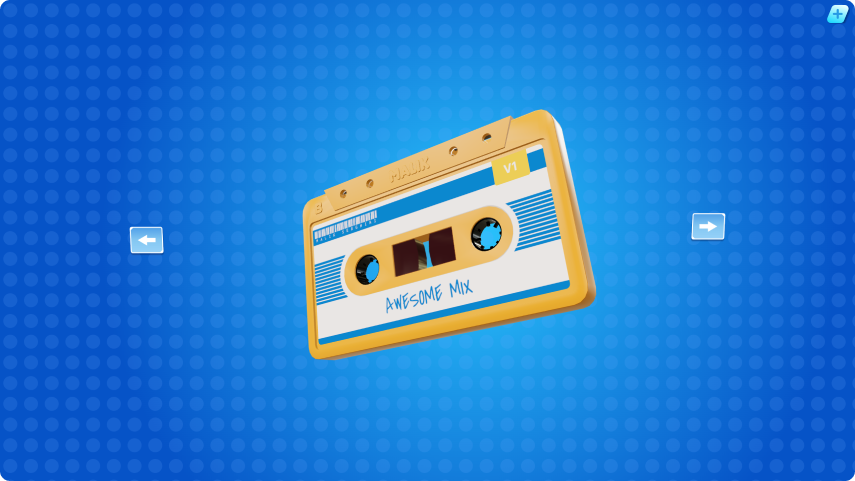
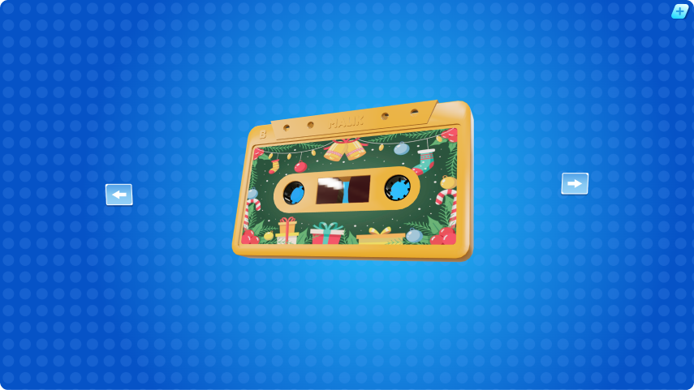
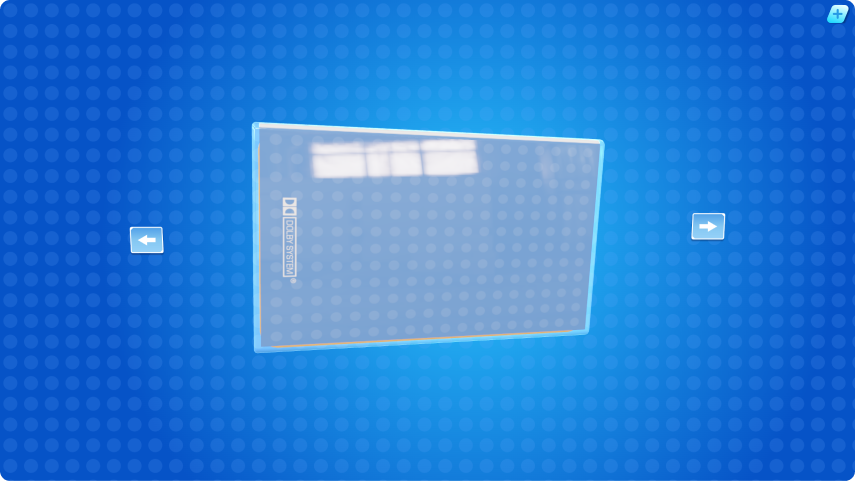
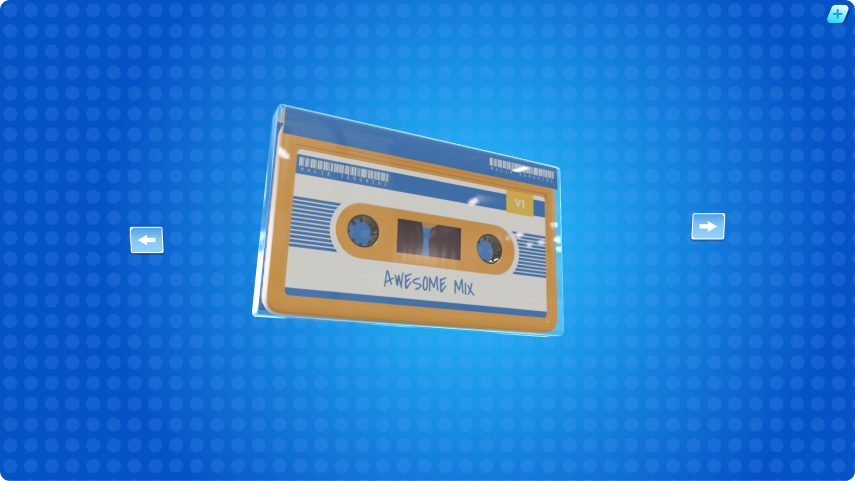
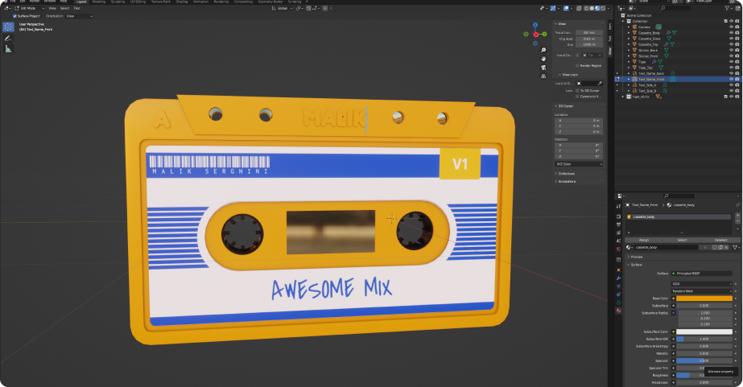
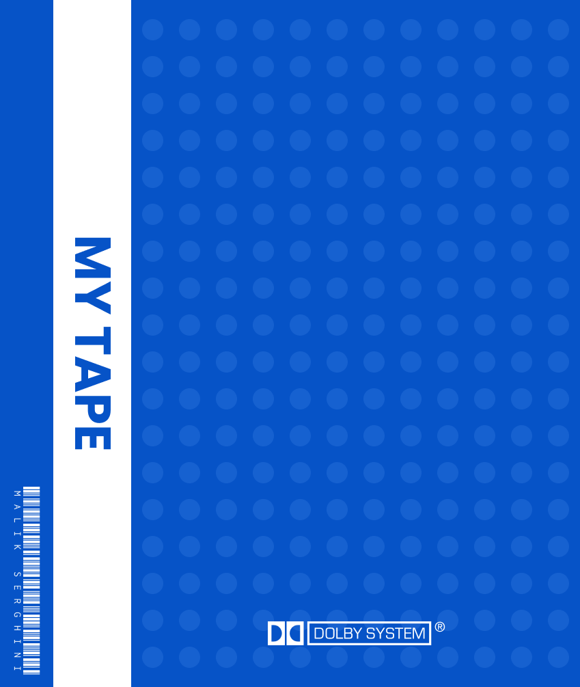
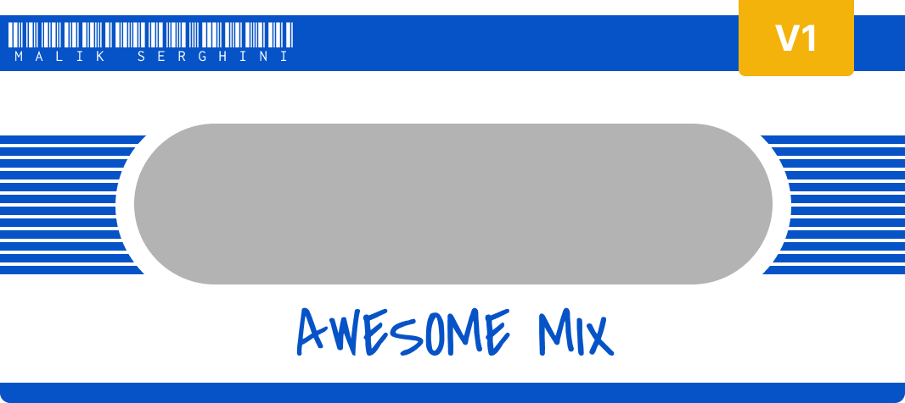

# ThreeJS Project for GLTF Texture Creation

This is a small React project, created with Vite, designed to generate textures for GLTF objects from uploaded files (JPG, PNG, SVG). The project includes two GLTF models that I created using Blender. These models are available for free use under the [GNU General Public License v3.0](https://www.gnu.org/licenses/gpl-3.0.en.html).

## Explanation

This project allows users to upload image files and apply them as textures to GLTF-Models.
The models used in this project are designed and created in Blender.

## UI-Preview

<br><br>


<details>
<summary>Preview J-Card</summary>

   
   

</details>

## How to Use the Project

1. **Clone the Repository and run the following Commands**
```bash
npm install
npm run dev
```

2. Press this Icon, to add a new Texture:<br><br>

>Please note, that only JPG, PNG and SVG Files are supported

## Blender Models

>public/Blender

The GLTF models included in this project were created by me using Blender. These models are licensed under the GNU General Public License v3.0, which allows for free use, distribution, and modification. You are welcome to use these models in your own projects.




## Textures

<details>
<summary>Texture J-Card</summary>



</details>

<details>
<summary>Texture Tape-Sticker</summary>



</details>


## License
This project is licensed under the GNU General Public License v3.0. You are free to use, modify, and distribute the code and models included in this repository, provided that any derivative works are also shared under the same license.
